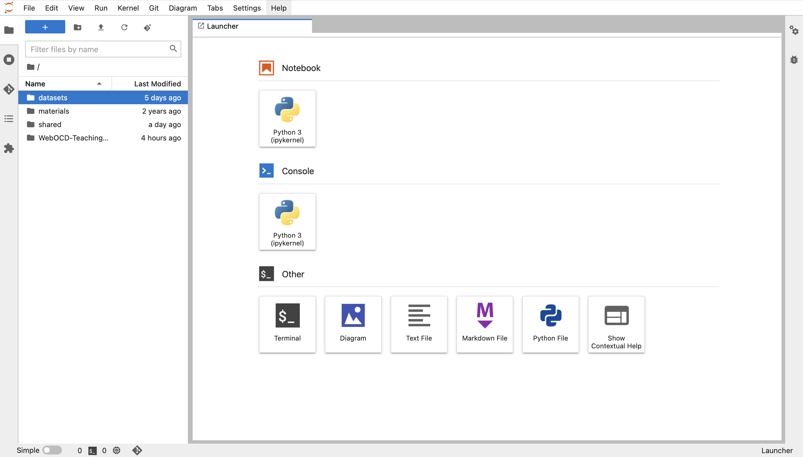
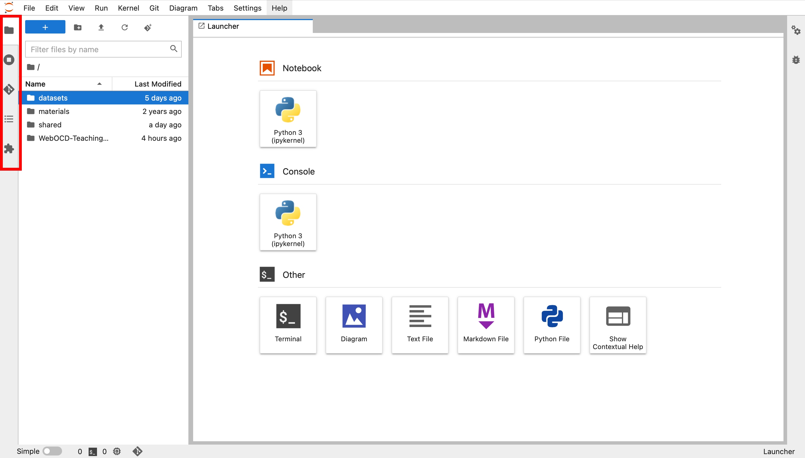
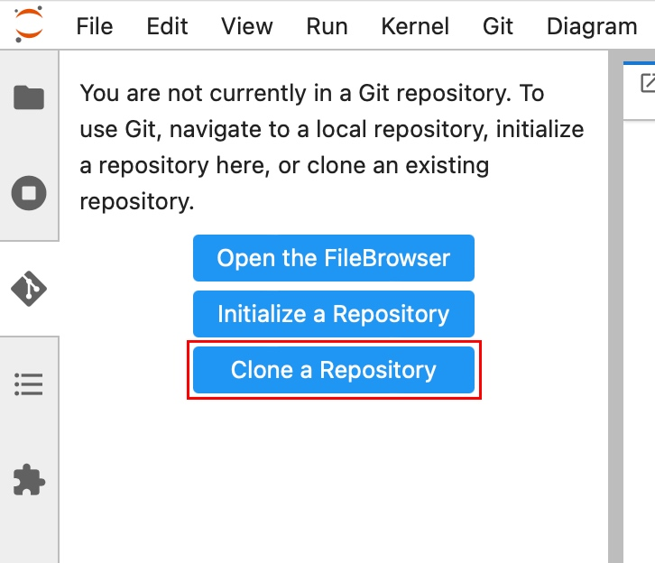

# WebOCD-Teaching-Materials
This repository contains teaching materials for the WebOCD service. The materials are provided as Jupiter notebooks.

The materials in this repository are intended to facilitate the use of [WebOCD](https://github.com/rwth-acis/REST-OCD-Services) and the corresponding [web service](https://github.com/rwth-acis/OCD-Web-Client) for teaching. For additional information on requirements, ideas, and interests one can check the respective [Teaching-requirement](https://requirements-bazaar.org/projects/137/categories/1542) in the requirements-bazaar.

## Creation of Teaching Materials
To make sure, that the teaching materials in this repository fulfill their purpose, are easily maintainable, and somehow similar in structure and appearance, their creation follows a specific concept. The most important steps in the creation process of the materials are to break down the materials into small self-contained chunks that can then be grouped into bigger chunks. By this, we ensure great modification possibilities. Also, it makes a lot of sense to link documents among each other. Simple and challenging questions can help to deepen the learned knowledge.

## Running the Materials
To run the notebooks contained in this repository, students at the RWTH Aachen University can use the [JupyterHub Cluster](https://jupyter.rwth-aachen.de/) of the RWTH. People who are interested in the provided materials who have no access to the RWTH infrastructure have a large number of options to run Jupiter notebooks as well. One can use the Jupyter project in the web browser, and there exist various plugins for VSCode and Pycharm. For beginners, the easiest way might be to download the Python data science distribution [Anaconda](https://www.anaconda.com/products/distribution), where Jupyter is included.

### RWTH Jupyter Cluster
Students at the RWTH Aachen University can easily use the [Jupyter Cluster](https://jupyter.rwth-aachen.de/) of the RWTH. There is no additional account creation required, since the SSO of the RWTH can be used to login. After logging in, one can choose between the existing profiles. For the use of the teaching materials in this repository, choose the *Python* profile. A click on the *Start* button, which is located on the bottom of the page, starts the personal server. After the server started succesfully, one can see the interface of the Jupyter hub.

On the left, one can choose between different menues like the File Browser and the Extension Manager.

Click the *Git* tab to clone the GitHub repository of the teaching materials. Choose the option *Clone a Repository*

and paste the following link: https://github.com/rwth-acis/WebOCD-Teaching-Materials. Clicking the *CLONE* button clones the repository which can be accessed using the File Browser. Now, all contained notebooks can be opened and started.
